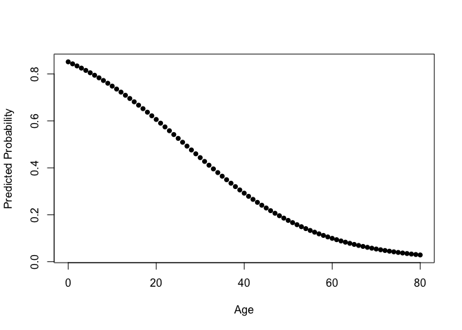
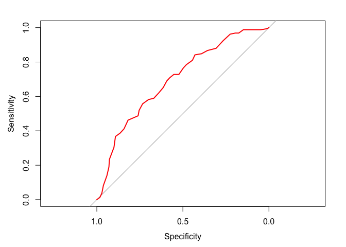

Logistic Regression with R
================
Charlotte\_k
1/15/2022

#### **0. Logistic Regression Intro.**

-   Similar to a linear regression model **where the dependent variable
    is categorical** rather than numeric (continuous).
-   This note focus on **binary** dependent variable (0 or 1). For
    example, pass/fail, alive/dead, win/lose…etc.
-   Approach: the binary logistic model is used to **estimate the
    probability** (based on odds) of a binary response.

#### **1. Load Churn data, take a look at the file and see summary**

``` r
churndata = read.table('/Users/rouhsin_charlotte/Downloads/6312:13_Statistics data/Churndata.dat', header = TRUE)
head(churndata)
```

    ##   Age Loyalty Dropout
    ## 1  28       4       0
    ## 2  50       4       0
    ## 3  34       1       1
    ## 4  47       2       0
    ## 5  42       2       0
    ## 6  60       5       0

``` r
summary(churndata)
```

    ##       Age           Loyalty         Dropout     
    ##  Min.   :20.00   Min.   :0.000   Min.   :0.000  
    ##  1st Qu.:30.00   1st Qu.:1.000   1st Qu.:0.000  
    ##  Median :40.00   Median :2.000   Median :0.000  
    ##  Mean   :39.77   Mean   :2.404   Mean   :0.316  
    ##  3rd Qu.:49.00   3rd Qu.:4.000   3rd Qu.:1.000  
    ##  Max.   :60.00   Max.   :5.000   Max.   :1.000

#### **2. Build Logistic Regression Model (Choosing Logistic Model)**

-   There are other well-defined nonlinear models like Angular,
    Gompertz, Burr, Urban, **Logistics, and Probit.**
-   We are getting **Ln(Odds(DropOut)) = b0 + b1xAge**

``` r
churn.logit = glm(Dropout~Age, data = churndata, family = binomial(link = 'logit'))
summary(churn.logit)
```

    ## 
    ## Call:
    ## glm(formula = Dropout ~ Age, family = binomial(link = "logit"), 
    ##     data = churndata)
    ## 
    ## Deviance Residuals: 
    ##     Min       1Q   Median       3Q      Max  
    ## -1.3651  -0.8783  -0.6223   1.1344   2.1479  
    ## 
    ## Coefficients:
    ##              Estimate Std. Error z value Pr(>|z|)    
    ## (Intercept)  1.747680   0.368643   4.741 2.13e-06 ***
    ## Age         -0.065825   0.009607  -6.852 7.30e-12 ***
    ## ---
    ## Signif. codes:  0 '***' 0.001 '**' 0.01 '*' 0.05 '.' 0.1 ' ' 1
    ## 
    ## (Dispersion parameter for binomial family taken to be 1)
    ## 
    ##     Null deviance: 623.82  on 499  degrees of freedom
    ## Residual deviance: 570.98  on 498  degrees of freedom
    ## AIC: 574.98
    ## 
    ## Number of Fisher Scoring iterations: 3

#### **2.1 Show Predicted Values**

``` r
churndata["PredVal"] = predict(churn.logit, list(Age = churndata$Age), type = "link")
churndata["PredProb"] = predict(churn.logit, list(Age = churndata$Age), type = "response")
head(churndata)
```

    ##   Age Loyalty Dropout     PredVal   PredProb
    ## 1  28       4       0 -0.09541317 0.47616479
    ## 2  50       4       0 -1.54355788 0.17601866
    ## 3  34       1       1 -0.49036173 0.37980836
    ## 4  47       2       0 -1.34608360 0.20651139
    ## 5  42       2       0 -1.01695980 0.26562002
    ## 6  60       5       0 -2.20180547 0.09958847

#### **2.2 Prediction Based on Specific Values of IDVs**

``` r
logits = predict(churn.logit, newdata = data.frame(Age = c(40,50)), type = "response")
logits
```

    ##         1         2 
    ## 0.2920786 0.1760187

#### **3. Plot the Model**

``` r
AgeVals = seq(0,80,1)
NewData = data.frame(AgeVals)
NewData["PredVal"] = predict(churn.logit, list(Age = NewData$AgeVals), type = "link")
NewData["PredProb"] = exp(NewData$PredVal)/(1+exp(NewData$PredVal))
NewData["PredProb2"] = predict(churn.logit, list(Age = NewData$AgeVals), type = "response")
print(head(NewData))
```

    ##   AgeVals  PredVal  PredProb PredProb2
    ## 1       0 1.747680 0.8516600 0.8516600
    ## 2       1 1.681855 0.8431501 0.8431501
    ## 3       2 1.616031 0.8342470 0.8342470
    ## 4       3 1.550206 0.8249435 0.8249435
    ## 5       4 1.484381 0.8152334 0.8152334
    ## 6       5 1.418556 0.8051120 0.8051120

``` r
plot(NewData$AgeVals, NewData$PredProb, pch = 16, xlab = "Age", ylab = "Predicted Probability")
```

<!-- -->

#### **4. Interpretation of B0 and B1**

-   `exp(b1)` represents the **expected amount by which odds are
    multiplied** when the independent variable is increased by 1 unit.
-   `(exp(b1)-1)x100` represents the **expected percentage change in the
    odds** associated with a 1 unit increase in the independent
    variable.
-   `exp(b0)` represents the **expected odds when the independent
    variable is equal to 0**. In the current context, it’s meaningless.

#### **5. Hypothesis Test in Logistic Regression**

H0: B1 = 0 The best-fitting logistic curve in population is a horizontal
straight line. H1: B1 != 0 The best-fitting logistic curve in population
is NOT a horizontal straight line.

#### **6. How well is your prediction model?**

-   There’s no R^2 statistic with logistic regression.
-   Pseudo R^2, in this case, serve a similar purpose: McFadden’s R2

##### **a. McFadden’s R2**

-   Ranging from 0 to just under 1, with values closer to 1 indicating
    the model has more predictive power.
-   Values **greater than 0.4** are good.

``` r
library(pscl)
```

    ## Classes and Methods for R developed in the
    ## Political Science Computational Laboratory
    ## Department of Political Science
    ## Stanford University
    ## Simon Jackman
    ## hurdle and zeroinfl functions by Achim Zeileis

``` r
pR2(churn.logit)
```

    ## fitting null model for pseudo-r2

    ##           llh       llhNull            G2      McFadden          r2ML 
    ## -285.49052891 -311.90876192   52.83646602    0.08469859    0.10028113 
    ##          r2CU 
    ##    0.14068289

##### **b. Receiver Operating Characteristic (ROC) Curves and AUROC**

-   ROC measures classification performance.

``` r
library(pROC)
```

    ## Type 'citation("pROC")' for a citation.

    ## 
    ## Attaching package: 'pROC'

    ## The following objects are masked from 'package:stats':
    ## 
    ##     cov, smooth, var

``` r
ROC.curve = roc(Dropout~Age, data = churndata)
```

    ## Setting levels: control = 0, case = 1

    ## Setting direction: controls > cases

``` r
plot(ROC.curve, col = "red")
```

<!-- -->

-   Area under the ROC curve ranges from 0.5 ro 1.
-   Values **above 0.8** indicate that the model does a **good job in
    discriminating between the two categories of the outcome variable**.

``` r
# Area under the curve
auc(ROC.curve)
```

    ## Area under the curve: 0.6982

#### **6.1 Is a Logistic Curve Appropriate?: Hosmer-Lemeshow Goodness of Fit Test**

-   The test computed on data (observations) segmented into groups with
    similar predicted probabilities.
-   To see whether the observed proportions of events are similar to the
    predicted probabilities in subgroups using a **Pearson Chi Square
    test**.
-   H0: the model fits the data

``` r
library(ResourceSelection)
```

    ## ResourceSelection 0.3-5   2019-07-22

``` r
hoslem.test(churndata$Dropout, fitted(churn.logit), g=10)
```

    ## 
    ##  Hosmer and Lemeshow goodness of fit (GOF) test
    ## 
    ## data:  churndata$Dropout, fitted(churn.logit)
    ## X-squared = 13.673, df = 8, p-value = 0.0907

p-value &gt; 0.05 indicates a good fit.

#### **Appendix A: Validation of Predicted Values: Classification Rates**

library(InformationValue)
confusionMatrix(churndata*D**r**o**p**o**u**t*, *c**h**u**r**n**d**a**t**a*PredBin,
0.5)
sensitivity(churndata*D**r**o**p**o**u**t*, *c**h**u**r**n**d**a**t**a*PredBin,
0.5)
specificity(churndata*D**r**o**p**o**u**t*, *c**h**u**r**n**d**a**t**a*PredBin,
0.5)
precision(churndata*D**r**o**p**o**u**t*, *c**h**u**r**n**d**a**t**a*PredBin,
0.5)
npv(churndata*D**r**o**p**o**u**t*, *c**h**u**r**n**d**a**t**a*PredBin,
0.5)

#### **Appendix B: Finding the Optimal Threshold to Maximize Accuracy**

Usually, only when we want to improve certain stats will we find the
optimal threshold

``` r
library(InformationValue)
optimalCutoff(churndata$Dropout, churndata$PredProb)
```

    ## [1] 0.4861566
